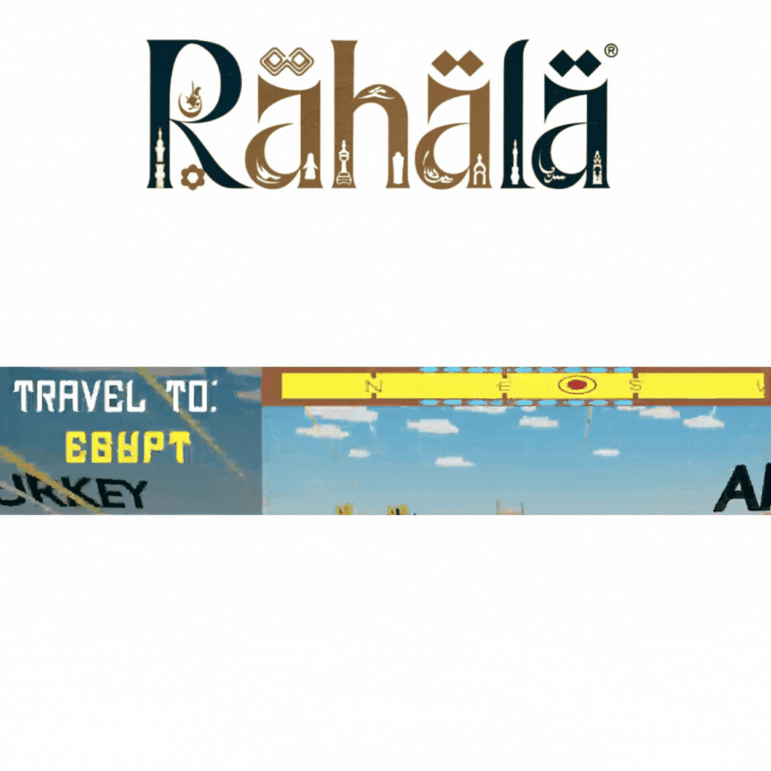
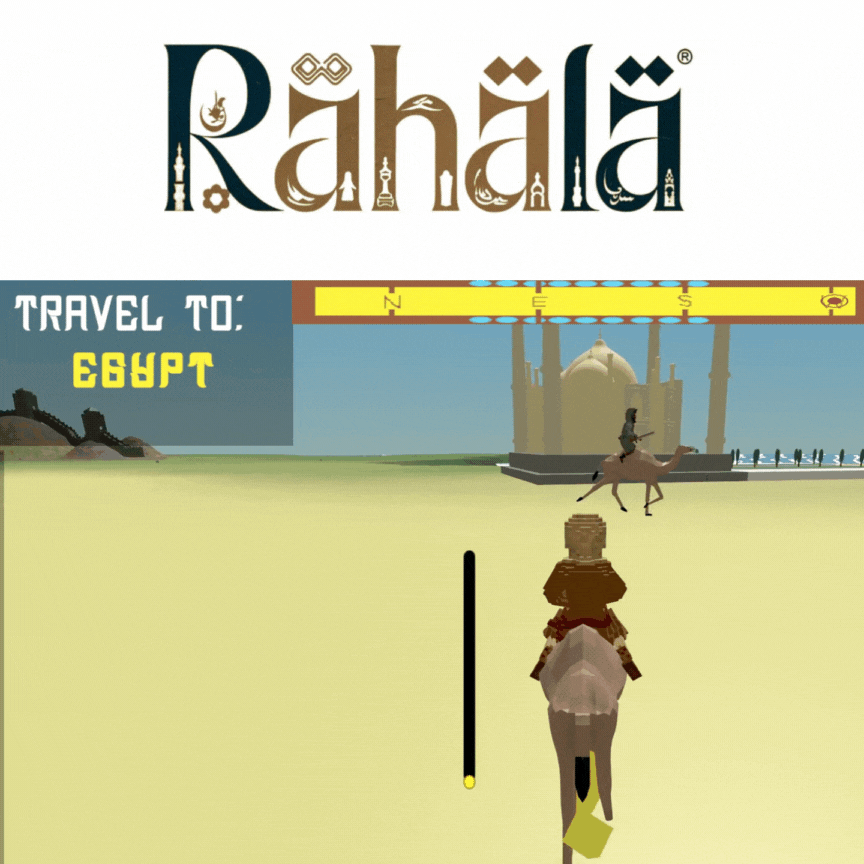

# Rahala
## Story
The game depicts the journey that Ibn Battuta took to travel the entire world, though its not an exact replication of it, its used to adhere to the theme "Journey of Ibn Battuta".

## GameJam
Submission for the CTRL GameJam occured on November, 2024.

## Features:
### Seamless Transport Method Change

  

### Trivia Style Cutscene
Once the player reaches the quest marker, a cutscene starts showcasing travia on what Ibn Battuta did within that country.

  

### Stamina System
Players can move faster at the sacrifice of their stamina, players cannot use this feature when detected by enemies.

  

### Compass
Quest Tracker and compass can be seen ontop of the screen, helps guide players to the next destination.

  

### Coin Pickups
Players can collide with coins to gain points which they would decide their scoring at the end.

  

### Combat
Enemies roam around the specific areas of the game, there are of two types, ships and mounted bandits, ships can be destroyed with cannon fire while mounted bandits should only be avoided, getting hit by either enemy will reduce the amount of coins the player collected.

  
  

### Crafting
Feature wasn't made in time, however the game does intend to have crafting in its system to create tools and quest items.
